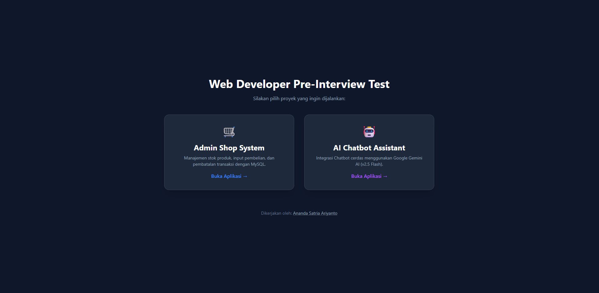
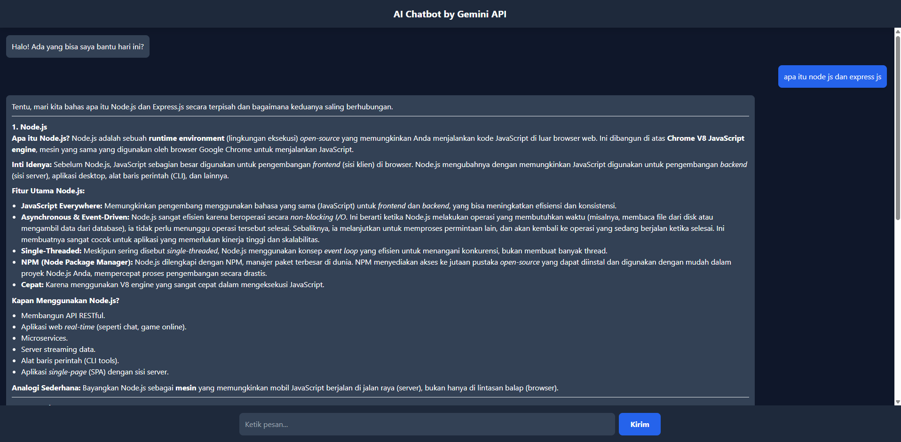

# Web Developer & IT Support Technical Test

Selamat datang di repositori hasil pengerjaan **Technical Test** saya. Proyek ini mencakup tiga komponen utama yang saling terintegrasi:

1. **Portal Landing Page**
2. **Admin Shop System (CRUD & Database)**
3. **AI Chatbot Assistant (Google Gemini Integration)**

---

## 🚀 Tampilan Aplikasi

### 1. Portal Landing Page

Halaman utama sebagai pintu masuk untuk mengakses seluruh sistem.



### 2. Admin Shop System

Sistem manajemen pembelian dan stok produk berbasis database MySQL dengan tampilan tab yang responsif.


### 3. AI Chatbot Assistant

Chatbot cerdas dengan integrasi Google Gemini AI dan dukungan format Markdown.



---

## 🛠️ Tech Stack

- **Backend:** Node.js, Express.js
- **Database:** MySQL, Sequelize ORM
- **Frontend:** EJS (Embedded JavaScript Templates), Tailwind CSS, Alpine.js
- **Markdown Rendering:** Marked.js
- **AI Integration:** Google Gemini AI SDK (Gemini Pro / Gemini 2.5 Flash)
- **Tooling:** Laragon, VS Code

---

## ✨ Fitur Utama

### Admin Shop System

- **Real-time Stock Update**
  Stok produk otomatis berkurang saat transaksi pembelian dan kembali bertambah saat transaksi dibatalkan.

- **Tabbed Interface**
  Navigasi antar form transaksi dan monitoring inventory tanpa reload halaman menggunakan Alpine.js.

- **Inventory Monitoring**
  Monitoring total penjualan per produk dan sisa stok gudang secara akurat.

- **Database Seeding**
  Tersedia 10 data produk teknologi riil untuk memudahkan proses testing.

### AI Chatbot Assistant

- **Markdown Rendering**
  Respon AI ditampilkan rapi dengan format **bold**, _list_, dan paragraf terstruktur menggunakan Marked.js.

- **Latest AI Model**
  Menggunakan Google Gemini untuk menghasilkan respon yang cepat dan relevan.

- **Clean & Modern UI**
  Antarmuka _dark mode_ yang responsif dan nyaman digunakan.

---

## ⚙️ Instalasi & Konfigurasi

### 0. Clone Repository dari GitHub

1. Pastikan **Git** sudah terinstall di komputer Anda.
2. Buka Terminal / Command Prompt.
3. Jalankan perintah berikut:

```bash
git clone https://github.com/anandasatriaa/web-dev.git
```

4. Masuk ke folder project:

```bash
cd web-dev
```

---

### 1. Persiapan Database (MySQL)

1. Pastikan MySQL pada **Laragon** atau **XAMPP** sudah berjalan.
2. Buat database baru dengan nama:

   ```sql
   db_penjualan
   ```

3. Masuk ke folder `admin-shop`, lalu jalankan perintah berikut:

   ```bash
   cd admin-shop
   npm install
   npx sequelize-cli db:migrate
   npx sequelize-cli db:seed:all
   ```

---

### 2. Persiapan AI Chatbot

1. Masuk ke folder `ai-chatbot`:

   ```bash
   cd ../ai-chatbot
   npm install
   ```

2. Buat file `.env` di dalam folder `ai-chatbot` dan isi dengan:

   ```env
   GEMINI_API_KEY=isi_api_key_gemini_anda_disini
   PORT=3002
   ```

---

### 3. Persiapan Portal Utama

1. Kembali ke folder root project:

   ```bash
   cd ..
   npm install
   ```

---

## 🏃 Cara Menjalankan Aplikasi

Untuk menjalankan seluruh sistem, buka **3 terminal terpisah**:

### Terminal 1 – Portal Utama

```bash
node server.js
```

Berjalan di: **[http://localhost:8000](http://localhost:8000)**

### Terminal 2 – Admin Shop System

```bash
cd admin-shop
node app.js
```

Berjalan di: **[http://localhost:3001](http://localhost:3001)**

### Terminal 3 – AI Chatbot Assistant

```bash
cd ai-chatbot
node app.js
```

Berjalan di: **[http://localhost:3002](http://localhost:3002)**

➡️ Akses utama aplikasi melalui: **[http://localhost:8000](http://localhost:8000)**

---

## 👨‍💻 Author

**Ananda Satria Ariyanto**
🌐 Portfolio: [https://anandasatriaa.github.io](https://anandasatriaa.github.io)
